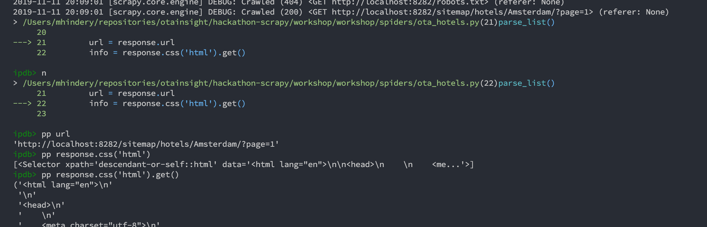

# 1. Introduction

The workshop contains of two parts. The first aspect is a data science task on a pre-existing dataset. The second task is an introduction to website crawling.

We recommend that some people start with the data science task and that the others start with the scraping part in parallel.

#### Website crawing 101
You're going to scrape the information of a website with rates of hotel rooms. Your server is located on [http://35.233.25.116/](http://35.233.25.116/) and represents a very basic OTA (Online Travel Agency, e.g. [Booking.com](https://www.booking.com), [Expedia](https://www.expedia.com/), [Hotels.com](https://nl.hotels.com/) ...). Our website contains some real rates: they come from [Booking.com](https://www.booking.com) and span about three months in the future. The data can be divided into a subset of hotel room rates from a few cities, extracted earlier this month. You're going to extract the data from this website yourself in the crawling part.

 Accross the site, some realistic anti-bot measures were put in place which you'll have to take into account while scraping our OTA. The anti-bot measures are different per city. While scraping rates for hotels in e.g. Amsterdam you will encounter different anti-bot measures as compared to scraping rates of hotels in e.g. London. You should start with the easiest city and work your way up. You'll be asked questions about the data of every city. Once you have scraped and processed the data for one city you can start answering the corresponding questions. Then you continue scraping the next city and answer those questions.

If you have any questions about what to do, need help, or have any other question, be sure to ask us. We're present with some people to help you out. If you are stuck anywhere along one of the tasks for a while, call us to help you.


# 2. Tasks to do

## Task 1: Analysis on rates dataset

The analysis on the pre-filled dataset can be done separately from the website scraping task.

The analysis should be performed using [this notebook on Google Colab](https://colab.research.google.com/drive/1uebtfVFwjz8DYoz_B2eD4yoBX1EWkxER?usp=sharing).
The notebook has a description of the data and the subtasks that should be solved. Furthermore, it contains already implemented code to load the data from Cloud Storage into a dataframe.
For the analysis you will use the [Pandas](https://pandas.pydata.org/docs/) library, which is one of the most well-known data analysis Python packages.

## Task 2: Website scraping - data extraction

This part contains the steps to implement the website crawler. which will visit all pages of the website and extract some raw data from it. We'll implement it in Python using the framework [Scrapy](https://scrapy.org/). This is the most well-known and widely used scraping framework, which we ourselves run as well on a very large scale.

Start by looking around a bit on the site. It's a very simple website with regards to its structure and functionality. You can search for a room using the form on the homepage, which will give you a list of matching hotels, and if you click through on each, it will show you the information of the rate. For simplicity here, every combination of a hotel, arrival date and departure date only has 1 rate (or no rate of course, if it doesn't offer anything for a certain date). On real websites, you'll nearly always get multiple rates with different characteristics; different types of beds, seaside views, with or without breakfast included, some you can cancel without paying a fee and some you cannot ... These determine the price you pay. On your target website, we have selected just one of them to keep it simple.


### Setup

In order to start, you can checkout the skeleton repository on [Github: blank scraping repo](blank_scraping_repo). This contains a Scrapy project with the blanks in the code for you to fill in. In order to run it, you'll need to have Python installed. Make a virtual environment for this project and install the requirements for it:

```bash
mkvirtualenv workshop-scrapy
pip install -r requirements.txt
```

*Note: it is possible that Scrapy does not install on your machine. If you encounter issues, have a look on the [Scrapy installation instructions](http://doc.scrapy.org/en/latest/intro/install.html#platform-specific-installation-notes) if one of the solutions there solves your problem.*

### Get all the available hotels and their properties present on the site

Note: This following description follows the scrapy tutorial on the [Scrapy Docs](https://docs.scrapy.org/en/latest/intro/tutorial.html#scrapy-tutorial), so make sure to have a look there as well.

*Note: scroll down to `Analysis on the crawled data` to see the questions you need to answer. You can answer these partially, per city, and don't need to wait untill you have everything.*

First you need to gather information about the inventory on the site: Which hotels are offering rates there? Every hotel on the site has some information about it on the site which you'll also need to store for analysis later on (e.g. the number of stars rating it has). Look where you can find this information on the site and how it is structured. In the same way you visit the site in your browser, your scraper will have to follow links to get to all pages it needs (but while you can just have a look, visually understand stuff and click around, your spider (i.e. the software component that crawls the website) can only follow the rigid url structure you'll define in the code).

In the file `workshop/workshop/spiders/ota_hotels.py` there is a spider class `OtaHotelsSpider` where you need to implement this spider. It has two placeholder methods you'll need to fill in. To run this spider as it is, which will do a request to google and output a dummy dictionary, do:

```bash
cd workshop
scrapy crawl ota_hotels
```

It will output some configuration info, then the list of every url it visits, the items resulting from `parse_function`, periodically some stats about its progress and at the end some stats about all the requests it did:

```
(workshop-scrapy) mhindery@Mathieus-MBP workshop % scrapy crawl ota_hotels
2021-11-13 13:49:43 [scrapy.utils.log] INFO: Scrapy 2.5.1 started (bot: workshop)
2021-11-13 13:49:43 [scrapy.utils.log] INFO: Versions: lxml 4.6.4.0, libxml2 2.9.10, cssselect 1.1.0, parsel 1.6.0, w3lib 1.22.0, Twisted 21.7.0, Python 3.9.4 (default, Apr 28 2021, 08:56:53) - [Clang 11.0.3 (clang-1103.0.32.62)], pyOpenSSL 21.0.0 (OpenSSL 1.1.1l  24 Aug 2021), cryptography 35.0.0, Platform macOS-10.16-x86_64-i386-64bit
2021-11-13 13:49:43 [scrapy.utils.log] DEBUG: Using reactor: twisted.internet.selectreactor.SelectReactor
2021-11-13 13:49:43 [scrapy.crawler] INFO: Overridden settings:
...
... some config info ...
...
2021-11-13 13:49:43 [scrapy.core.engine] INFO: Spider opened
2021-11-13 13:49:43 [scrapy.extensions.logstats] INFO: Crawled 0 pages (at 0 pages/min), scraped 0 items (at 0 items/min)
2021-11-13 13:49:43 [ota_hotels] INFO: Spider opened: ota_hotels
...
... urls being visited ...
...
2021-11-13 13:49:43 [scrapy.core.scraper] DEBUG: Scraped from <200 https://www.google.com/>
...
... items we got from the dummy implementation: ...
...

{'Success': True}
2021-11-13 13:49:43 [scrapy.core.engine] INFO: Closing spider (finished)
...
... some stats when it finishes ...
...
2021-11-13 13:49:43 [scrapy.statscollectors] INFO: Dumping Scrapy stats:
{'downloader/request_bytes': 590,
 'downloader/request_count': 2,
 'downloader/request_method_count/GET': 2,
 'downloader/response_bytes': 62411,
 'downloader/response_count': 2,
 'downloader/response_status_count/200': 2,
 'elapsed_time_seconds': 0.328673,
 'finish_reason': 'finished',
 'finish_time': datetime.datetime(2021, 11, 13, 12, 49, 43, 847121),
 'httpcompression/response_bytes': 182558,
 'httpcompression/response_count': 2,
 'item_scraped_count': 1,
 'log_count/DEBUG': 3,
 'log_count/INFO': 9,
 'memusage/max': 53493760,
 'memusage/startup': 53493760,
 'response_received_count': 2,
 'robotstxt/request_count': 1,
 'robotstxt/response_count': 1,
 'robotstxt/response_status_count/200': 1,
 'scheduler/dequeued': 1,
 'scheduler/dequeued/memory': 1,
 'scheduler/enqueued': 1,
 'scheduler/enqueued/memory': 1,
 'start_time': datetime.datetime(2021, 11, 13, 12, 49, 43, 518448)}
2021-11-13 13:49:43 [scrapy.core.engine] INFO: Spider closed (finished)
```

There are 2 methods you need to implement: `start_requests` and `parse_function`. The `start_requests` function is the entry point of your scraper: it is a generator function that yields the urls and callback functions that the spider should crawl and call. When the spider has crawled an url, it will call the callback function with the raw crawled response. In that callback function (in this case `parse_function`, you can have multiple ones and name them however you like), you extract the information from the response and yield it as a dictionary. If you are not yet familiar with generator functions in Python, [this](https://realpython.com/introduction-to-python-generators/) is a useful link.

Look in the [Scrapy tutorial part about data extracting](https://docs.scrapy.org/en/latest/intro/tutorial.html#extracting-data) for how to get the elements you need. Start with a basic implementation in your parsing method and make sure you can reach all the hotels before getting lost in trying to extract all info from each hotel; due to some anti-bot measures, you won't be able to get everything at first. **Start with the hotels from Amsterdam.** That city is the easiest and has no anti-crawl measures. Once Amsterdam works, see a later part to add data for other cities.

To investigate how to extract the necessary elements from the website responses, start by yielding (one or) some hardcoded urls in `start_requests`. The Scrapy documentation mentions the [Scrapy shell](https://docs.scrapy.org/en/latest/topics/shell.html#topics-shell) which you can use to interactively inspect a response. You can also use [Ipdb](https://pypi.org/project/ipdb/), which opens an interactive ipython shell in case you want to debug something; add this line as the first one in your function.

```python
def parse_function(self, response):
    import ipdb; ipdb.set_trace()
    # rest of your functions' code
```

Now run the crawler, and it will allow you to debug your coded by stepping through it. Useful basic commands are
- `n`: *next*; execute the line which the arrow is pointing at and go forward.
- `c`: *continue*; let your program run along (until the end or until you set a new breakpoint)
- `pp <item>`: pretty-print an object.

It looks like this:



You can try some data extracting here interactively using the `response` object. Your parsing function needs to yield a dictionary, with all of the information in it. Store as much information about the hotel as possible; it's easier to later correct mistakes when you have all raw data. It's a lot quicker and cheaper to transform the data which you have versus having to recrawl that data because you didn't store some information.

Run your crawler and look at the logs, they will contain the items you generate. Compare the info against what you see yourself on the site.

Once you (think you) have the spider done (**to reiterate, focus on Amsterdam only for the time being**) and it's yielding dicts for each hotels, you can run it with a flag to store every item being yielded in a json file locally (which you'll read in a next stage). In this case the results are small enough to save on disk on a file, in real life scenario's (and at OTA Insight its scale) this if of course not the case and we'd put this into streaming data processing queues and a database. Having it in a json locally works well here and is easy to work with and inspect. Run it with the output flag like this:

```bash
scrapy crawl ota_hotels -o hotels.json
```

Note that successive runs will append to this file and not overwrite is, so it's best to remove or rename it after you made changes to your crawler.

#### Scale it up

Once you can succesfully crawl hotels and their info, you'll want to speed it up, and do some more requests concurrenctly. Otherwise you won't be able to get all the data in time. Have a look to tweak some of the settings to increase the throughput.

Once you've increased the throughput, do some different runs and compare the output results. Depending on which destinations you are crawling, you might see different results (the ordering of items is irrelevent, compare the content, e.g. number of hotels you get each time ...). The differences will occur in destinations different from Amsterdam. If you look at the logs from your run, and the output statistics at the end, you might see what is causing this. Have a look around (in the Scrapy docs, Google around) what you are experiencing here and how you can handle this issue with Scrapy... As a hint, some things will only occur if you have increased the throughput sufficiently.

### Get the rates of all hotels on the site for the coming three months.

Now that you have (some of) the hotels in the inventory of the site, you can start getting the rates for them. The file `workshop/spiders/ota_rates.py` will contain the spider for the rates. Implement it in the same way as you have done the previous spider; Look around on the website for how the url's are structured so you can generate them in `start_requests`. Going via the search form every time and looping through the results would be very inneficient (in reality this is most of the time not feasible). The hotels available on the website are available in the json you made in the previous step, so use that to generate requests.

Our dataset contains rates with number of persons in a room being 1 or 2, arrival dates ranging from now to about three months in the future, and number of nights for a stay being 1 or 2. Make a `start_requests` method to loop over all destinations, all hotels in each destination, and all the date ranges.

Extract the properties of each rate and yield a dictionary from your parse function. For the time being, also use the `-o rates.json` flag to store the results in a json file. You can inspect the results easily this way.

*Note: we advise to store as much **raw** information as possible in the item you are yielding. The goal of the scraper is to just collect web pages, extract parts of it and then push them to a later component. That later component (a data transformation step) will then process the item and this is where you'll do things like string parsing of raw information in your item. This allows you to do a bugfix in your transformation step if you encounter e.g. a new type of breakfast-included message and reprocess all the items that you crawled with the latest transformation code to correct things in your database, without having to recrawl.*

Note that you likely won't be able to access all rates with your first attempt. This is intentional due to the anti-crawl measures. **Focus on the rates in Amsterdam first to get your crawler going.** Once Amsterdam works, see later parts for adding data for other cities.

**Don't forget to answer the questions in `Analysis on the crawled data` when you crawled a city**. You should not wait with answering the questions until you have scraped all cities.◊

### 2.a.3 Add other data than Amsterdam.

For different locations, the website will behave a bit different. Amsterdam is the easiest one. When you get that going, you can start looking into adding data from other locations. The recommended ordering to start crawling cities: Amsterdam, Brussels, Paris, London, Berlin. Some anti-bot measures from earlier cities are also present in later cities. Both the inventory of the hotels in a destination and the rates of a destination contain similar anti-crawl measures.

#### Add data for Brussels

#### Add data for Paris

At this point, try looking at the hotels and rates in Paris.

The rates (and hotels) for Paris are likely not going to work; you'll get an http 403 response when scraping. Find out why that is, and implement a change to counter this blocking.

Compare what your browser is sending vs what Scrapy is sending as a request. Have a look at the docs on [Best Practices](https://docs.scrapy.org/en/latest/topics/practices.html) if you see anything which might be relevant for you.

#### Add data for London

Add the hotels and rates from London. Something is wrong on these rates, they'll likely not be parsed by your current implementation. Find out why your scraper is not working and fix it. You might have to look for alternatives here :)

As the golden hint: this line might be necessary for the rates :)

```python
soup = BeautifulSoup(response.text, 'html5lib')
```

#### Add data for Berlin

You should get an error when scraping rates there. Look again at what is different between the request from scrapy vs the request from your browser, use your browser inspector to see what the site is doing. If you get a 403 response, it's because of something different; the issue you're looking for will resut in a 400 response.

### Analysis on the crawled data

These are questions about the data you gathered from the website. Each of them asks the question 'per city', so you can start looking for the solution as soon as you have some data from the easiest city, and add to your response when you have 'unlocked' the other cities. ***Since there is a timing component to the points awarded for the answers, don't wait until you have a response for all cities before giving us your answer. As soon as you have something, let us know!***

#### Hotels

- How many hotels, and how many rooms do we have in each city?
- For each destination, which hotels are the furthest apart? Use the normal euclidian $L^2$ norm as distance metric.

#### Rates

- Per city: across all hotels in a city over the entire period, how many rates are there on the website, what is the minimum / mean / maximum value of the advertised rates?

- how many of them are refundable and non-refundable, how many include breakfast or not?

- Give the percentage of hotels per destination which have availability on 25-12-2021

- What's the average price per person per night for a destination and number of stars. Do this in two steps:
  - Calculate for every rate the per-person-per-night cost, and take for each hotel the cheapest of the available options per arrival date. For example, if you arrive at a certain date, there could be a room for 2 persons for a stay of 2 nights available, and there could also be a room for 1 person for 2 nights available. In order to allow some form of comparions, equalize each rate to this per-person-per-night cost. Note that this calculation, and looking at the cheapest option, assumes that you would be able to pick and match rates; take a night from the first option from the example, and then 1 night from the second option. In reality this is not the case, but otherwise a comparison would be infeasible here.

- For stays of 1 night and 2 persons, calculate the average price for a room for each hotel if you arrive on a weekday versus if you arrive on a weekend day. How many hotels are more expensive in the weekend than during the week? Why is that do you think? Only include hotels that have prices both on weekends and weekdays

    Could you think of an explanaction as to why this is? Not something which is necessarily present in the data, just think about it.
